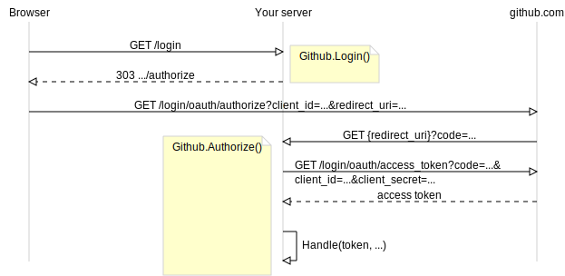

[gregoryv/oauth](https://pkg.go.dev/github.com/gregoryv/oauth)
module provides handlers to enable login using [github oauth](https://docs.github.com/en/apps/oauth-apps/building-oauth-apps/authorizing-oauth-apps).

See [Example (Github)](https://pkg.go.dev/github.com/gregoryv/oauth#example-package-Github)
